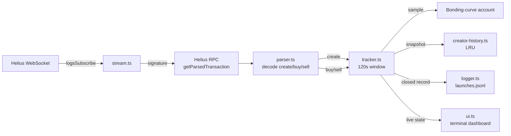

# pumpfun-launch-watcher

> Real-time pump.fun token launch monitor for Solana — track new launches, creator history, bonding-curve velocity, and first-buyer flow. Open data feed for Solana trading bots, MEV research, and memecoin analytics.


A small, focused CLI that streams every new pump.fun token launch on Solana the moment it hits a confirmed slot, watches the first 30/60/120 seconds of trading, snapshots the creator's prior history (graduations, rugs, repeat behavior), and prints it all into a live terminal dashboard. Every event also gets appended to a JSONL log you can feed into a notebook, a backtester, or your own filter pipeline.

```
pumpfun-launch-watcher — live
ws=open  up=14m  launches=312  graduated=8  rugged=21  creators_cached=287

┌────────┬──────────┬──────────────┬──────────────┬──────────────────┬───────┬────────┬──────────────────────────┬───────────┐
│ age    │ symbol   │ mint         │ creator      │ flag             │ BC%   │ buyers │ flags                    │ status    │
├────────┼──────────┼──────────────┼──────────────┼──────────────────┼───────┼────────┼──────────────────────────┼───────────┤
│ 12s    │ MOON     │ 7Hk2…q3Pa    │ Ax9k…7n2P    │ NEW_CREATOR      │ 4.1   │ 14     │ WHALE_BUYER_PRESENT      │ active    │
│ 47s    │ DOGE2    │ 3pqn…9Ww4    │ Cv3q…5kK1    │ SERIAL_GRADUATOR │ 18.3  │ 41     │ –                        │ active    │
│ 2m     │ RUGSTOP  │ Bf7t…2yYa    │ Mn8r…4tP9    │ KNOWN_RUGGER     │ 0.6   │ 3      │ SUSPECTED_DUMP_IN_WINDOW │ active    │
└────────┴──────────┴──────────────┴──────────────┴──────────────────┴───────┴────────┴──────────────────────────┴───────────┘

log=./launches.jsonl   graduated=2.6%   rugged=6.7%
```

---

## Why this exists

Every Solana bot dev who tries to filter pump.fun launches ends up writing the same boring infrastructure first: WebSocket subscribe, Anchor-decode the `create` instruction, fetch the bonding curve, track the creator. Days of boilerplate before you can write a single line of actual filter logic.

This is that boilerplate, free and open. Run it, point your filter at `launches.jsonl`, get to the interesting part faster.

---

## How to monitor pump.fun token launches in real time

If you're building a Solana trading bot, the first technical problem is always the same: you need a real-time pump.fun token monitor that surfaces every new mint within a slot or two of confirmation. Polling RPC for new accounts doesn't work — by the time `getProgramAccounts` returns, the launch is already 10+ seconds old, the first 50 trades have happened, and any sniper that cared is long out. Latency is the entire game; a polling architecture loses it before you've written your first filter.

The right primitive is a push-based feed. Standard Solana RPC providers expose `logsSubscribe` over WebSocket, which fires the moment a transaction touching a given program is confirmed — that's good enough Solana token launch detection for almost every use case, and it's what this tool defaults to. If you need lower latency, Helius's Geyser-enhanced Atlas endpoint streams account-level state changes ahead of confirmation; it's a one-line swap in `.env` (`WS_URL=wss://atlas-mainnet.helius-rpc.com/?api-key=...`).

What this tool surfaces per launch: mint address, name, symbol, creator wallet, initial bonding-curve state, plus a 120-second window of every buy and sell with wallet, SOL amount, and time-since-launch. Combined with the creator-history cache, that's enough signal to drive new token alerts for trading bots, score launches in real time, or build a backtest corpus from `launches.jsonl`. It is not a hosted analytics dashboard — it's the cold infrastructure layer underneath one.

---

## How to track new Solana token launches and creator history

Order-flow signals (first-buyer wallets, buy/sell ratio, bonding-curve velocity) tell you what's happening *right now*. They're noisy — a single whale can move them in either direction. Creator behavior is the strongest non-flow signal because it tells you what this wallet has done *before*: how many tokens they've launched, how many graduated to Raydium, how many turned out to be rugs.

Every time the watcher sees a `create` instruction, it looks up the creator wallet in an in-memory LRU cache (default 10k creators) and tags the launch with one of four flags:

- **`NEW_CREATOR`** — first launch we've ever seen from this wallet during this run. No history to score against; treat as unknown.
- **`REPEAT_CREATOR`** — has launched before, mixed or insufficient outcome data. A "this wallet is active" signal without a quality claim.
- **`SERIAL_GRADUATOR`** — 3+ prior launches with ≥50% graduation rate. Strong positive signal.
- **`KNOWN_RUGGER`** — 2+ prior launches with ≥50% rug rate. Strong negative signal.

The cache lives only as long as the process runs (Postgres backing is on the roadmap). For meaningful creator data, run the watcher continuously over days, not minutes — the longer it's up, the more useful the history becomes. If you need history persisted across restarts today, tail `launches.jsonl` and rebuild the cache from disk on startup; it's ~30 lines.

---

## Features

- **Real-time launch detection** via Helius WebSocket `logsSubscribe` — new mints land in the dashboard within ~1 slot of confirmation.
- **Anchor instruction decoding** for pump.fun `create`, `buy`, and `sell` (top-level and CPI'd from aggregators).
- **Bonding-curve velocity tracking** — samples the curve account at 30s / 60s / 120s and reports % progress to graduation.
- **First-buyer flow** — every buy and sell in the first 120s is captured with wallet, SOL amount, token amount, and time-since-launch.
- **Creator history & flags** — `NEW_CREATOR`, `REPEAT_CREATOR`, `SERIAL_GRADUATOR`, `KNOWN_RUGGER`, computed from prior launches seen by this process.
- **JSONL logging** — every closed window is appended to `launches.jsonl` for offline analysis, backtesting, or feeding into a downstream filter.
- **Auto-reconnecting WebSocket** with exponential backoff. Survives Helius restarts.
- **Cross-platform** — macOS, Linux, Windows (PowerShell). No native deps.
- **Bounded memory** — LRU cache of creators, signature-dedup ring buffer.

---

## Quick start

```bash
git clone https://github.com/YOUR_USERNAME/pumpfun-launch-watcher.git
cd pumpfun-launch-watcher
npm install
cp .env.example .env    # then edit .env and set HELIUS_API_KEY
npm run dev
```

That's it. You should see the dashboard within a few seconds of starting.

For headless / piped operation:

```bash
HEADLESS=true npm run dev | tee my-run.log
```

For a packaged build:

```bash
npm run build
npm start
```

---

## Example JSONL output

Every closed launch window emits one line like this:

```json
{
  "signature": "5cQ…",
  "slot": 312456789,
  "detectedAt": 1730928001234,
  "mint": "7Hk2…q3Pa",
  "name": "MoonShot",
  "symbol": "MOON",
  "creator": "Ax9k…7n2P",
  "creatorFlag": "NEW_CREATOR",
  "creatorPriorLaunches": 0,
  "trades": [
    { "kind": "buy", "user": "5fG2…", "tokenAmount": "12345678", "solAmount": "1500000000", "msSinceLaunch": 1240 }
  ],
  "curveSamples": [
    { "tSeconds": 30, "curvePercent": 4.1, "complete": false },
    { "tSeconds": 60, "curvePercent": 9.7, "complete": false },
    { "tSeconds": 120, "curvePercent": 14.2, "complete": false }
  ],
  "uniqueBuyers": 18,
  "uniqueSellers": 4,
  "totalBuySol": "5400000000",
  "totalSellSol": "800000000",
  "status": "active",
  "flags": ["WHALE_BUYER_PRESENT"]
}
```

`u64` values (`tokenAmount`, `solAmount`, `totalBuySol`, etc.) are strings to preserve precision — parse with `BigInt(...)`.

---

## Use cases

- **Build a filter for your sniping/trading bot.** Pipe `launches.jsonl` into your scoring logic; only act on launches matching your criteria.
- **Backtest filter strategies** against a corpus of historical launches you've collected.
- **Research creator behavior** — graduation rates, rug rates, repeat patterns.
- **Monitor specific creators or wallets** by adding a downstream `jq` filter on the JSONL.
- **Feed a Telegram/Discord alert bot** — tail the JSONL, alert on `creatorFlag=SERIAL_GRADUATOR` or `flags` contains `WHALE_BUYER_PRESENT`.

---

## Architecture



---

## Configuration

All settings come from `.env` (see [.env.example](.env.example)):

| Variable | Default | Purpose |
|---|---|---|
| `HELIUS_API_KEY` | _(required)_ | Your Helius key. Free tier works for v1. |
| `RPC_HTTP_URL` | derived from key | Override to use a custom RPC endpoint. |
| `WS_URL` | derived from key | Override to use Atlas/Geyser endpoints on paid plans. |
| `PUMPFUN_PROGRAM_ID` | mainnet pump.fun | Override only if pump.fun moves. |
| `LOG_FILE` | `./launches.jsonl` | JSONL output path. |
| `TRACKING_WINDOW_SECONDS` | `120` | How long to track each launch. |
| `TRACKING_CHECKPOINTS` | `30,60,120` | When to sample the bonding curve. |
| `MAX_CREATORS_CACHED` | `10000` | LRU bound on the creator history cache. |
| `DASHBOARD_RECENT_ROWS` | `10` | Rows shown in the live table. |
| `DASHBOARD_REFRESH_MS` | `1000` | Dashboard refresh interval. |
| `HEADLESS` | `false` | Disable the live UI; emit one-line log lines instead. |

---

## Roadmap

- [ ] Long-horizon outcome tracker (real rug detection, hours not seconds)
- [ ] Telegram / Discord alerter (subscribe to flag patterns)
- [ ] Postgres backend (persistent creator history across restarts)
- [ ] Web dashboard (read JSONL or DB, replay/live)
- [ ] Jito bundle correlation (link launches to atomic snipe bundles)
- [ ] Multi-DEX support (LetsBonk, Moonshot, Pump.fun AMM post-graduation)

---

## Contributing

PRs welcome. Good first issues:
- Add unit tests for [src/parser.ts](src/parser.ts) instruction decoding
- Add a `--mint <addr>` CLI flag to filter the dashboard to one mint
- Add a long-horizon outcome scanner (the [Roadmap](#roadmap) item)
- Improve Windows terminal compatibility (color depth, screen clear)

Run `npm run lint` before submitting.

---

## FAQ

**How do I detect new pump.fun tokens in real time?** Subscribe to the pump.fun program ID over Solana WebSocket `logsSubscribe`, then fetch and decode each transaction to find the `create` instruction. This repo does exactly that out of the box — clone, set `HELIUS_API_KEY` in `.env`, run `npm run dev`, and new launches appear in the dashboard within ~1 slot of confirmation. Polling-based approaches (`getProgramAccounts` on a timer) are too slow to be useful for sniping or alerting.

**What is the pump.fun program ID?** `6EF8rrecthR5Dkzon8Nwu78hRvfCKubJ14M5uBEwF6P` on Solana mainnet. It's hard-coded as the default in [.env.example](.env.example) and overridable via the `PUMPFUN_PROGRAM_ID` env var if pump.fun ever migrates programs.

**Do I need a Helius API key?** A free Helius key is the path of least resistance — sign up at https://helius.dev and paste it into `.env`. Internally the code only depends on `logsSubscribe` and `getParsedTransaction`, both standard Solana JSON-RPC methods, so any RPC provider that supports them will work. Override `RPC_HTTP_URL` and `WS_URL` to point elsewhere.

**Can I use this without paying for Helius?** Yes. The free Helius tier handles a single watcher comfortably for development and personal use — well under the 10 req/sec free-tier ceiling. If you outgrow it, options are: upgrade to a paid Helius plan (Atlas Geyser is the fastest), switch to another provider (Triton, QuickNode, Shyft), or run your own RPC node.

**How do I track a specific creator wallet?** Two options. (1) Run the watcher in headless mode (`HEADLESS=true npm run dev`) and pipe through `grep` or `jq` filtered on the wallet address. (2) Tail the JSONL — `tail -f launches.jsonl | jq 'select(.creator == "WALLET_ADDR")'`. A built-in `--creator` filter flag is a good first contribution.

**Can I export the data for backtesting?** Every closed launch window is appended to `launches.jsonl` (path overridable via `LOG_FILE`). One JSON object per line, with all trade events, curve samples, creator metadata, and flags. Load it into pandas, DuckDB, ClickHouse, or whatever your analysis stack is — `bigint` fields are stringified to preserve precision, parse them back with `BigInt(...)`.

**What's the difference between this and Birdeye / DEX Screener?** Those are hosted analytics dashboards optimized for human browsing of tokens that already have meaningful liquidity. This is an open, programmable, sub-second feed of *every* launch the moment it happens, designed to feed into your own bot, alerter, or filter pipeline. Different tool, different layer of the stack — most serious bot devs end up running both.

**Is this safe to run on a wallet machine?** It's a read-only data tool — no signing, no private keys, no transactions submitted. The only credential it needs is your Helius RPC key, which is read access only. Standard hygiene still applies: pin dependencies, audit `package.json` before `npm install`, and prefer running on a separate machine or container from anything holding signing keys.

**Can I use this for other launchpads (LetsBonk, Moonshot)?** Not yet — the parser is pump.fun-specific. Multi-DEX support is on the roadmap; the stream/tracker/logger split is designed so adding a new parser is the only real work.

**How do I add my own filter?** Two options. (1) Tail `launches.jsonl` and filter downstream — recommended, decoupled, language-agnostic. (2) Fork and add filter logic in [src/index.ts](src/index.ts) inside the `tracker.on('record')` handler.

**Is the rug detection reliable?** No. Within a 120-second window you cannot reliably distinguish a rug from a slow start. The dashboard's `rugged` count is heuristic-only (sell volume > 2× buy volume). Real rug detection requires hours of post-launch monitoring — the long-horizon outcome tracker on the roadmap is where that lives.

**Is this financial advice?** No. This is a data feed. What you do with it is on you.

---

## Related projects

If this tool is useful to you, you may also want:

- **[jito-region-bench](https://github.com/YOUR_USERNAME/jito-region-bench)** — benchmark Jito block engine regions for optimal bundle landing.
- **[solana-bot-skeleton](https://github.com/YOUR_USERNAME/solana-bot-skeleton)** — modular Rust framework for building Solana trading bots.

---

## Acknowledgments

- [Helius](https://helius.dev) for the RPC and WebSocket infrastructure.
- [pump.fun](https://pump.fun) for being a target rich enough to warrant tooling.
- The Solana developer community.

---

## Tags

solana, pumpfun, pump.fun, trading-bot, mev, jito, helius, geyser, defi, memecoin, sniper-bot, bonding-curve, token-launch, real-time, websocket, typescript, nodejs, solana-bot, copy-trading, defi-tools
